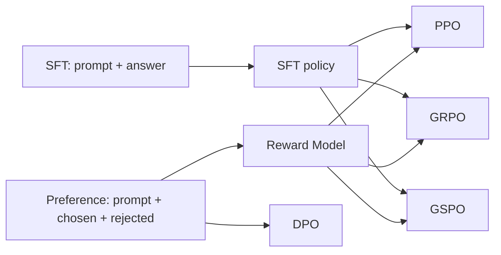

## Dataset

### 统一约定

生产中建议将 prompt 统一表示为消息列表，避免在数据层拼接 Qwen、Llama 等模型的聊天模板：

```json
{
  "prompt": [
    {"role": "system", "content": "你是一个严谨的助手。"},
    {"role": "user", "content": "解释什么是过拟合。"}
  ]
}
```

文中的 `chosen`、`rejected`、`completion` 都是 **assistant 的纯文本回答**。不同框架也可能要求将它们表示为 assistant 消息列表；这只是序列化差异，语义不变。



上图描述的是主观偏好任务的常见生产链路。对于数学、代码等可验证任务，PPO、GRPO、GSPO 中的 RM 可以被确定性奖励函数替代。

### SFT

SFT（Supervised Fine-Tuning）需要“上下文 + 标准回答”。推荐格式：

```json
{"messages":[
  {"role":"system","content":"你是一个专业的客服助手。"},
  {"role":"user","content":"订单什么时候发货？"},
  {"role":"assistant","content":"订单通常会在付款后 48 小时内发出。"}
]}
```

多轮 SFT 只需要继续追加消息：

```json
{"messages":[
  {"role":"user","content":"什么是 LoRA？"},
  {"role":"assistant","content":"LoRA 是一种参数高效微调方法。"},
  {"role":"user","content":"它的主要优点是什么？"},
  {"role":"assistant","content":"它只训练少量新增参数，因此显存和存储成本较低。"}
]}
```

旧式 Alpaca 数据也很常见：

```json
{"instruction":"解释什么是 LoRA。","input":"","output":"LoRA 是一种参数高效微调方法。"}
```

其语义等价于：`instruction + input` 是 user 内容，`output` 是 assistant 内容。

### Reward Model（RM）

RM 的任务不是生成文本，而是对候选回答排序或打分。它训练所需的数据是偏好对：同一个 prompt 下，一条 `chosen` 优于一条 `rejected`。

```json
{
  "prompt": [
    {"role":"user","content":"请简要解释什么是过拟合。"}
  ],
  "chosen": "过拟合是模型过度记住训练数据，导致它在新数据上的泛化能力下降。",
  "rejected": "过拟合就是模型训练得很久。"
}
```

RM 训练完成后，对任意 `(prompt, completion)` 输出一个标量奖励：

```text
reward = RM(prompt, completion)
```

PPO、GRPO、GSPO 在主观偏好任务中依赖这个分数作为优化目标。因此，偏好对不是直接喂给它们的策略训练数据，而是先用于训练 RM。

### DPO

DPO 使用的输入与 RM 相同，仍然是偏好对：

```json
{
  "prompt": [
    {"role":"user","content":"给出一条节水建议。"}
  ],
  "chosen": "优先修复漏水点，并使用节水型器具。",
  "rejected": "多用水可以保证生活质量。"
}
```

差别在于：DPO **不需要先单独训练 RM**。它直接根据 `chosen` 与 `rejected` 的相对偏好更新策略模型。

数据质量要求：

1. `chosen` 和 `rejected` 必须回答同一个 prompt。
2. `chosen` 应在正确性、安全性、帮助性或风格上显著更优。
3. 不要把“回答更长”当作“回答更好”。

### PPO

PPO 的策略优化数据通常只有 prompt：

```json
{
  "prompt": [
    {"role":"user","content":"用三句话解释光合作用。"}
  ]
}
```

训练过程为：

```text
读取 prompt
-> 当前策略在线生成 completion
-> RM(prompt, completion) 计算奖励
-> PPO 根据奖励更新策略
```

因此 PPO 需要两份不同的数据：

```text
RM 训练数据：prompt + chosen + rejected
PPO 策略数据：prompt
```

若使用可验证任务，也可以用规则函数代替 RM，例如检查数学最终答案或代码单元测试是否通过。

### GRPO

GRPO 的策略训练数据与 PPO 类似，通常也是 prompt：

```json
{
  "prompt": [
    {"role":"user","content":"计算 37 乘以 19，并只输出最终整数。"}
  ]
}
```

它与 PPO 的关键差别是：对于同一个 prompt，GRPO 会一次生成多条 completion，并根据一组奖励的相对高低进行优化。

主观偏好任务的奖励来自 RM：

```text
completions = policy.generate(prompt, n=G)
rewards = [RM(prompt, completion) for completion in completions]
```

可验证任务通常在数据中提供真值，并由规则奖励函数读取：

```json
{
  "prompt": [
    {"role":"user","content":"计算 37 乘以 19。请把最终答案放在 \\boxed{} 中。"}
  ],
  "answer": "703"
}
```

此时奖励可以是：答案正确得 1 分，格式正确得 0.1 分。`answer`、`solution`、`ground_truth` 等字段名必须与奖励函数读取的参数一致。

### GSPO

GSPO 的数据接口通常与 GRPO 相同：策略训练读取 prompt，RM 或规则奖励函数评价在线生成的 completion。

主观偏好任务：

```json
{
  "prompt": [
    {"role":"user","content":"解释为什么代码审查很重要。"}
  ]
}
```

随后由 RM 评分：

```text
reward = RM(prompt, completion)
```

可验证任务：

```json
{
  "prompt": [
    {"role":"user","content":"判断 97 是否为素数，只回答是或否。"}
  ],
  "answer": "是"
}
```

GSPO 与 GRPO 的主要差异在策略优化目标和序列级重要性采样，不在数据集字段。二者都不直接消费 `chosen/rejected`；在使用 RM 时，它们间接依赖由偏好对训练出来的 RM。